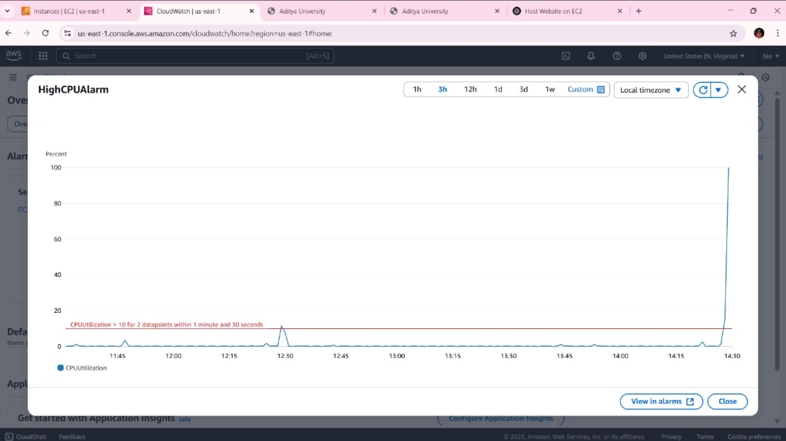

# Scalable Network Traffic Monitoring Powered by AWS

This project monitors and analyzes network traffic in real-time using **AWS VPC Flow Logs, CloudWatch, and AWS Lambda**.  
It provides instant alerts for abnormal behavior and ensures better visibility into network performance.

---

## Contents
- **lambda_function.py**: AWS Lambda function for processing logs.
- **template.yaml**: CloudFormation template to set up infrastructure.
- **requirements.txt**: Python dependencies.
- **Screenshots/**: Images showcasing architecture and alerts.

---

## Features
- Collects and analyzes **VPC Flow Logs**.
- Uses **AWS Lambda** for real-time log processing.
- Generates **alerts for suspicious traffic** using CloudWatch alarms.
- Scalable and serverless architecture.

---

## Usage
1. Deploy the stack using:
    ```
    aws cloudformation deploy --template-file template.yaml --stack-name NetworkMonitoringStack
    ```
2. Configure AWS credentials and install dependencies:
    ```
    pip install -r requirements.txt
    ```
3. Upload `lambda_function.py` to your AWS Lambda function.
4. Monitor traffic and alerts in **CloudWatch**.

---

## Screenshots

| **CloudWatch Metrics** | **High CPU Alarm** |
|------------------------|--------------------|
|  |  |

| **Alarms** | **Instances** |
|------------|---------------|
|  |  |

---

## Requirements
- AWS Account
- AWS CLI configured
- Python 3.x with `boto3` and `aws-sdk`

